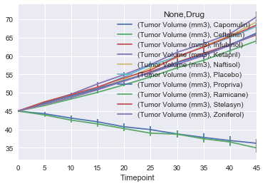
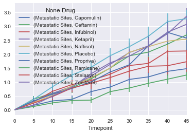
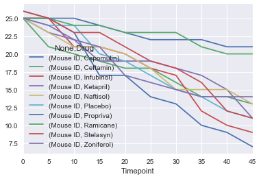
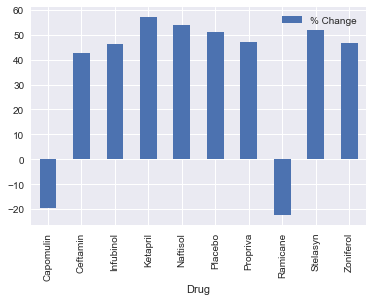

Observations:
1. Ramicane, Capomulin, Zoniferol, Naftisol, Ceftamin treatments all saw improved survival rates of mice. 
2. However only Ramicane and Capomulin resulted in reduction of cancer tumor volume, so might be the only two considered effective.
3. Infubinol and Propriva were more harmful than leaving mice untreated
4. Ramicane and Capomulin reduced the growth rate of metastatic sites, but did not halt it.
5. (what I thought of while doing this: https://xkcd.com/1217/)


```python
import pandas as pd
import numpy as np
from matplotlib import pyplot as plotter
from scipy.stats import sem
import seaborn
seaborn.set()
```


```python
mouse_df =  pd.read_csv("raw_data/mouse_drug_data.csv")
clinical_df = pd.read_csv("raw_data/clinicaltrial_data.csv")
clinical_df.head()
```


<div>
<style>
    .dataframe thead tr:only-child th {
        text-align: right;
    }

    .dataframe thead th {
        text-align: left;
    }

    .dataframe tbody tr th {
        vertical-align: top;
    }
</style>
<table border="1" class="dataframe">
  <thead>
    <tr style="text-align: right;">
      <th></th>
      <th>Mouse ID</th>
      <th>Timepoint</th>
      <th>Tumor Volume (mm3)</th>
      <th>Metastatic Sites</th>
    </tr>
  </thead>
  <tbody>
    <tr>
      <th>0</th>
      <td>b128</td>
      <td>0</td>
      <td>45.0</td>
      <td>0</td>
    </tr>
    <tr>
      <th>1</th>
      <td>f932</td>
      <td>0</td>
      <td>45.0</td>
      <td>0</td>
    </tr>
    <tr>
      <th>2</th>
      <td>g107</td>
      <td>0</td>
      <td>45.0</td>
      <td>0</td>
    </tr>
    <tr>
      <th>3</th>
      <td>a457</td>
      <td>0</td>
      <td>45.0</td>
      <td>0</td>
    </tr>
    <tr>
      <th>4</th>
      <td>c819</td>
      <td>0</td>
      <td>45.0</td>
      <td>0</td>
    </tr>
  </tbody>
</table>
</div>


```python
combo_df = mouse_df.merge(clinical_df,left_on='Mouse ID',right_on= 'Mouse ID')
combo_df.head()
```


<div>
<style>
    .dataframe thead tr:only-child th {
        text-align: right;
    }

    .dataframe thead th {
        text-align: left;
    }

    .dataframe tbody tr th {
        vertical-align: top;
    }
</style>
<table border="1" class="dataframe">
  <thead>
    <tr style="text-align: right;">
      <th></th>
      <th>Mouse ID</th>
      <th>Drug</th>
      <th>Timepoint</th>
      <th>Tumor Volume (mm3)</th>
      <th>Metastatic Sites</th>
    </tr>
  </thead>
  <tbody>
    <tr>
      <th>0</th>
      <td>f234</td>
      <td>Stelasyn</td>
      <td>0</td>
      <td>45.000000</td>
      <td>0</td>
    </tr>
    <tr>
      <th>1</th>
      <td>f234</td>
      <td>Stelasyn</td>
      <td>5</td>
      <td>47.313491</td>
      <td>0</td>
    </tr>
    <tr>
      <th>2</th>
      <td>f234</td>
      <td>Stelasyn</td>
      <td>10</td>
      <td>47.904324</td>
      <td>0</td>
    </tr>
    <tr>
      <th>3</th>
      <td>f234</td>
      <td>Stelasyn</td>
      <td>15</td>
      <td>48.735197</td>
      <td>1</td>
    </tr>
    <tr>
      <th>4</th>
      <td>f234</td>
      <td>Stelasyn</td>
      <td>20</td>
      <td>51.112713</td>
      <td>2</td>
    </tr>
  </tbody>
</table>
</div>


```python
grouped_data = combo_df.groupby(['Timepoint','Drug'])
grouped_data.head()
```


<div>
<style>
    .dataframe thead tr:only-child th {
        text-align: right;
    }

    .dataframe thead th {
        text-align: left;
    }

    .dataframe tbody tr th {
        vertical-align: top;
    }
</style>
<table border="1" class="dataframe">
  <thead>
    <tr style="text-align: right;">
      <th></th>
      <th>Mouse ID</th>
      <th>Drug</th>
      <th>Timepoint</th>
      <th>Tumor Volume (mm3)</th>
      <th>Metastatic Sites</th>
    </tr>
  </thead>
  <tbody>
    <tr>
      <th>0</th>
      <td>f234</td>
      <td>Stelasyn</td>
      <td>0</td>
      <td>45.000000</td>
      <td>0</td>
    </tr>
    <tr>
      <th>1</th>
      <td>f234</td>
      <td>Stelasyn</td>
      <td>5</td>
      <td>47.313491</td>
      <td>0</td>
    </tr>
    <tr>
      <th>2</th>
      <td>f234</td>
      <td>Stelasyn</td>
      <td>10</td>
      <td>47.904324</td>
      <td>0</td>
    </tr>
    <tr>
      <th>3</th>
      <td>f234</td>
      <td>Stelasyn</td>
      <td>15</td>
      <td>48.735197</td>
      <td>1</td>
    </tr>
    <tr>
      <th>4</th>
      <td>f234</td>
      <td>Stelasyn</td>
      <td>20</td>
      <td>51.112713</td>
      <td>2</td>
    </tr>
    <tr>
      <th>5</th>
      <td>f234</td>
      <td>Stelasyn</td>
      <td>25</td>
      <td>52.178602</td>
      <td>2</td>
    </tr>
    <tr>
      <th>6</th>
      <td>f234</td>
      <td>Stelasyn</td>
      <td>30</td>
      <td>56.873817</td>
      <td>2</td>
    </tr>
    <tr>
      <th>7</th>
      <td>f234</td>
      <td>Stelasyn</td>
      <td>35</td>
      <td>57.748758</td>
      <td>2</td>
    </tr>
    <tr>
      <th>8</th>
      <td>x402</td>
      <td>Stelasyn</td>
      <td>0</td>
      <td>45.000000</td>
      <td>0</td>
    </tr>
    <tr>
      <th>9</th>
      <td>x402</td>
      <td>Stelasyn</td>
      <td>5</td>
      <td>46.327570</td>
      <td>1</td>
    </tr>
    <tr>
      <th>10</th>
      <td>x402</td>
      <td>Stelasyn</td>
      <td>10</td>
      <td>46.886962</td>
      <td>1</td>
    </tr>
    <tr>
      <th>11</th>
      <td>x402</td>
      <td>Stelasyn</td>
      <td>15</td>
      <td>49.119948</td>
      <td>1</td>
    </tr>
    <tr>
      <th>12</th>
      <td>x402</td>
      <td>Stelasyn</td>
      <td>20</td>
      <td>50.414750</td>
      <td>2</td>
    </tr>
    <tr>
      <th>13</th>
      <td>x402</td>
      <td>Stelasyn</td>
      <td>25</td>
      <td>52.431737</td>
      <td>2</td>
    </tr>
    <tr>
      <th>14</th>
      <td>x402</td>
      <td>Stelasyn</td>
      <td>30</td>
      <td>54.351585</td>
      <td>3</td>
    </tr>
    <tr>
      <th>15</th>
      <td>x402</td>
      <td>Stelasyn</td>
      <td>35</td>
      <td>55.240962</td>
      <td>3</td>
    </tr>
    <tr>
      <th>16</th>
      <td>x402</td>
      <td>Stelasyn</td>
      <td>40</td>
      <td>56.691723</td>
      <td>3</td>
    </tr>
    <tr>
      <th>17</th>
      <td>x402</td>
      <td>Stelasyn</td>
      <td>45</td>
      <td>61.619606</td>
      <td>3</td>
    </tr>
    <tr>
      <th>18</th>
      <td>a492</td>
      <td>Stelasyn</td>
      <td>0</td>
      <td>45.000000</td>
      <td>0</td>
    </tr>
    <tr>
      <th>19</th>
      <td>a492</td>
      <td>Stelasyn</td>
      <td>5</td>
      <td>46.409143</td>
      <td>0</td>
    </tr>
    <tr>
      <th>20</th>
      <td>a492</td>
      <td>Stelasyn</td>
      <td>10</td>
      <td>48.432197</td>
      <td>0</td>
    </tr>
    <tr>
      <th>21</th>
      <td>a492</td>
      <td>Stelasyn</td>
      <td>15</td>
      <td>51.985263</td>
      <td>0</td>
    </tr>
    <tr>
      <th>22</th>
      <td>a492</td>
      <td>Stelasyn</td>
      <td>20</td>
      <td>53.677193</td>
      <td>0</td>
    </tr>
    <tr>
      <th>23</th>
      <td>a492</td>
      <td>Stelasyn</td>
      <td>25</td>
      <td>54.701229</td>
      <td>1</td>
    </tr>
    <tr>
      <th>24</th>
      <td>a492</td>
      <td>Stelasyn</td>
      <td>30</td>
      <td>56.201041</td>
      <td>1</td>
    </tr>
    <tr>
      <th>25</th>
      <td>a492</td>
      <td>Stelasyn</td>
      <td>35</td>
      <td>57.308554</td>
      <td>1</td>
    </tr>
    <tr>
      <th>26</th>
      <td>a492</td>
      <td>Stelasyn</td>
      <td>40</td>
      <td>57.928499</td>
      <td>1</td>
    </tr>
    <tr>
      <th>27</th>
      <td>a492</td>
      <td>Stelasyn</td>
      <td>45</td>
      <td>60.122011</td>
      <td>1</td>
    </tr>
    <tr>
      <th>28</th>
      <td>w540</td>
      <td>Stelasyn</td>
      <td>0</td>
      <td>45.000000</td>
      <td>0</td>
    </tr>
    <tr>
      <th>29</th>
      <td>w540</td>
      <td>Stelasyn</td>
      <td>5</td>
      <td>45.885370</td>
      <td>1</td>
    </tr>
    <tr>
      <th>...</th>
      <td>...</td>
      <td>...</td>
      <td>...</td>
      <td>...</td>
      <td>...</td>
    </tr>
    <tr>
      <th>1745</th>
      <td>i477</td>
      <td>Placebo</td>
      <td>0</td>
      <td>45.000000</td>
      <td>0</td>
    </tr>
    <tr>
      <th>1746</th>
      <td>i477</td>
      <td>Placebo</td>
      <td>5</td>
      <td>46.657385</td>
      <td>0</td>
    </tr>
    <tr>
      <th>1747</th>
      <td>i477</td>
      <td>Placebo</td>
      <td>10</td>
      <td>47.520632</td>
      <td>0</td>
    </tr>
    <tr>
      <th>1748</th>
      <td>o302</td>
      <td>Placebo</td>
      <td>0</td>
      <td>45.000000</td>
      <td>0</td>
    </tr>
    <tr>
      <th>1749</th>
      <td>o302</td>
      <td>Placebo</td>
      <td>5</td>
      <td>48.937012</td>
      <td>0</td>
    </tr>
    <tr>
      <th>1750</th>
      <td>o302</td>
      <td>Placebo</td>
      <td>10</td>
      <td>49.701450</td>
      <td>0</td>
    </tr>
    <tr>
      <th>1751</th>
      <td>o302</td>
      <td>Placebo</td>
      <td>15</td>
      <td>51.381489</td>
      <td>0</td>
    </tr>
    <tr>
      <th>1752</th>
      <td>o302</td>
      <td>Placebo</td>
      <td>20</td>
      <td>56.177611</td>
      <td>0</td>
    </tr>
    <tr>
      <th>1753</th>
      <td>o302</td>
      <td>Placebo</td>
      <td>25</td>
      <td>60.517103</td>
      <td>0</td>
    </tr>
    <tr>
      <th>1754</th>
      <td>o302</td>
      <td>Placebo</td>
      <td>30</td>
      <td>62.030594</td>
      <td>1</td>
    </tr>
    <tr>
      <th>1755</th>
      <td>t718</td>
      <td>Placebo</td>
      <td>0</td>
      <td>45.000000</td>
      <td>0</td>
    </tr>
    <tr>
      <th>1756</th>
      <td>t718</td>
      <td>Placebo</td>
      <td>5</td>
      <td>45.921253</td>
      <td>1</td>
    </tr>
    <tr>
      <th>1757</th>
      <td>t718</td>
      <td>Placebo</td>
      <td>10</td>
      <td>46.392688</td>
      <td>1</td>
    </tr>
    <tr>
      <th>1758</th>
      <td>t718</td>
      <td>Placebo</td>
      <td>15</td>
      <td>48.085126</td>
      <td>1</td>
    </tr>
    <tr>
      <th>1759</th>
      <td>t718</td>
      <td>Placebo</td>
      <td>20</td>
      <td>52.636700</td>
      <td>2</td>
    </tr>
    <tr>
      <th>1760</th>
      <td>t718</td>
      <td>Placebo</td>
      <td>25</td>
      <td>55.876588</td>
      <td>3</td>
    </tr>
    <tr>
      <th>1761</th>
      <td>t718</td>
      <td>Placebo</td>
      <td>30</td>
      <td>57.704114</td>
      <td>3</td>
    </tr>
    <tr>
      <th>1762</th>
      <td>t718</td>
      <td>Placebo</td>
      <td>35</td>
      <td>60.463899</td>
      <td>3</td>
    </tr>
    <tr>
      <th>1763</th>
      <td>t718</td>
      <td>Placebo</td>
      <td>40</td>
      <td>61.530399</td>
      <td>3</td>
    </tr>
    <tr>
      <th>1764</th>
      <td>t718</td>
      <td>Placebo</td>
      <td>45</td>
      <td>63.423695</td>
      <td>4</td>
    </tr>
    <tr>
      <th>1768</th>
      <td>w167</td>
      <td>Placebo</td>
      <td>15</td>
      <td>53.900489</td>
      <td>0</td>
    </tr>
    <tr>
      <th>1769</th>
      <td>w167</td>
      <td>Placebo</td>
      <td>20</td>
      <td>57.548157</td>
      <td>0</td>
    </tr>
    <tr>
      <th>1770</th>
      <td>w167</td>
      <td>Placebo</td>
      <td>25</td>
      <td>61.868577</td>
      <td>0</td>
    </tr>
    <tr>
      <th>1771</th>
      <td>w167</td>
      <td>Placebo</td>
      <td>30</td>
      <td>67.197872</td>
      <td>0</td>
    </tr>
    <tr>
      <th>1772</th>
      <td>w167</td>
      <td>Placebo</td>
      <td>35</td>
      <td>68.134288</td>
      <td>0</td>
    </tr>
    <tr>
      <th>1780</th>
      <td>x773</td>
      <td>Placebo</td>
      <td>35</td>
      <td>55.192736</td>
      <td>4</td>
    </tr>
    <tr>
      <th>1781</th>
      <td>x773</td>
      <td>Placebo</td>
      <td>40</td>
      <td>55.987676</td>
      <td>4</td>
    </tr>
    <tr>
      <th>1782</th>
      <td>x773</td>
      <td>Placebo</td>
      <td>45</td>
      <td>58.634971</td>
      <td>4</td>
    </tr>
    <tr>
      <th>1802</th>
      <td>y478</td>
      <td>Placebo</td>
      <td>40</td>
      <td>65.971120</td>
      <td>1</td>
    </tr>
    <tr>
      <th>1803</th>
      <td>y478</td>
      <td>Placebo</td>
      <td>45</td>
      <td>66.842635</td>
      <td>1</td>
    </tr>
  </tbody>
</table>
<p>500 rows × 5 columns</p>
</div>


```python
errSet = grouped_data['Tumor Volume (mm3)'].sem().to_frame().reset_index(level = 1).pivot(columns='Drug')
```


```python
volumeOverTime =  grouped_data['Tumor Volume (mm3)'].mean().to_frame().reset_index(level = 1).pivot(columns='Drug')
volumeOverTime.plot(yerr=errSet)
plotter.show()
```





```python
errSet2 = grouped_data['Metastatic Sites'].sem().to_frame().reset_index(level = 1).pivot(columns='Drug')
sitesOverTime =grouped_data['Metastatic Sites'].mean().to_frame().reset_index(level = 1).pivot(columns='Drug')
sitesOverTime.plot(yerr=errSet2,legend='best fit')
plotter.show()
```





```python
mouseOverTime = grouped_data['Mouse ID'].count().to_frame().reset_index(level = 1).pivot(columns='Drug')
mouseOverTime.plot()
plotter.show()
```





```python
 grouped_data['Metastatic Sites'].value_counts().to_frame()
```


<div>
<style>
    .dataframe thead tr:only-child th {
        text-align: right;
    }

    .dataframe thead th {
        text-align: left;
    }

    .dataframe tbody tr th {
        vertical-align: top;
    }
</style>
<table border="1" class="dataframe">
  <thead>
    <tr style="text-align: right;">
      <th></th>
      <th></th>
      <th></th>
      <th>Metastatic Sites</th>
    </tr>
    <tr>
      <th>Timepoint</th>
      <th>Drug</th>
      <th>Metastatic Sites</th>
      <th></th>
    </tr>
  </thead>
  <tbody>
    <tr>
      <th rowspan="10" valign="top">0</th>
      <th>Capomulin</th>
      <th>0</th>
      <td>25</td>
    </tr>
    <tr>
      <th>Ceftamin</th>
      <th>0</th>
      <td>25</td>
    </tr>
    <tr>
      <th>Infubinol</th>
      <th>0</th>
      <td>25</td>
    </tr>
    <tr>
      <th>Ketapril</th>
      <th>0</th>
      <td>25</td>
    </tr>
    <tr>
      <th>Naftisol</th>
      <th>0</th>
      <td>25</td>
    </tr>
    <tr>
      <th>Placebo</th>
      <th>0</th>
      <td>25</td>
    </tr>
    <tr>
      <th>Propriva</th>
      <th>0</th>
      <td>26</td>
    </tr>
    <tr>
      <th>Ramicane</th>
      <th>0</th>
      <td>25</td>
    </tr>
    <tr>
      <th>Stelasyn</th>
      <th>0</th>
      <td>26</td>
    </tr>
    <tr>
      <th>Zoniferol</th>
      <th>0</th>
      <td>25</td>
    </tr>
    <tr>
      <th rowspan="20" valign="top">5</th>
      <th rowspan="2" valign="top">Capomulin</th>
      <th>0</th>
      <td>21</td>
    </tr>
    <tr>
      <th>1</th>
      <td>4</td>
    </tr>
    <tr>
      <th rowspan="2" valign="top">Ceftamin</th>
      <th>0</th>
      <td>13</td>
    </tr>
    <tr>
      <th>1</th>
      <td>8</td>
    </tr>
    <tr>
      <th rowspan="2" valign="top">Infubinol</th>
      <th>0</th>
      <td>18</td>
    </tr>
    <tr>
      <th>1</th>
      <td>7</td>
    </tr>
    <tr>
      <th rowspan="2" valign="top">Ketapril</th>
      <th>0</th>
      <td>16</td>
    </tr>
    <tr>
      <th>1</th>
      <td>7</td>
    </tr>
    <tr>
      <th rowspan="2" valign="top">Naftisol</th>
      <th>0</th>
      <td>17</td>
    </tr>
    <tr>
      <th>1</th>
      <td>6</td>
    </tr>
    <tr>
      <th rowspan="2" valign="top">Placebo</th>
      <th>0</th>
      <td>15</td>
    </tr>
    <tr>
      <th>1</th>
      <td>9</td>
    </tr>
    <tr>
      <th rowspan="2" valign="top">Propriva</th>
      <th>0</th>
      <td>17</td>
    </tr>
    <tr>
      <th>1</th>
      <td>8</td>
    </tr>
    <tr>
      <th rowspan="2" valign="top">Ramicane</th>
      <th>0</th>
      <td>22</td>
    </tr>
    <tr>
      <th>1</th>
      <td>3</td>
    </tr>
    <tr>
      <th rowspan="2" valign="top">Stelasyn</th>
      <th>0</th>
      <td>19</td>
    </tr>
    <tr>
      <th>1</th>
      <td>6</td>
    </tr>
    <tr>
      <th rowspan="2" valign="top">Zoniferol</th>
      <th>0</th>
      <td>20</td>
    </tr>
    <tr>
      <th>1</th>
      <td>4</td>
    </tr>
    <tr>
      <th>...</th>
      <th>...</th>
      <th>...</th>
      <td>...</td>
    </tr>
    <tr>
      <th rowspan="30" valign="top">45</th>
      <th rowspan="2" valign="top">Infubinol</th>
      <th>1</th>
      <td>3</td>
    </tr>
    <tr>
      <th>2</th>
      <td>2</td>
    </tr>
    <tr>
      <th rowspan="3" valign="top">Ketapril</th>
      <th>4</th>
      <td>7</td>
    </tr>
    <tr>
      <th>2</th>
      <td>3</td>
    </tr>
    <tr>
      <th>3</th>
      <td>1</td>
    </tr>
    <tr>
      <th rowspan="4" valign="top">Naftisol</th>
      <th>1</th>
      <td>4</td>
    </tr>
    <tr>
      <th>4</th>
      <td>4</td>
    </tr>
    <tr>
      <th>3</th>
      <td>3</td>
    </tr>
    <tr>
      <th>2</th>
      <td>2</td>
    </tr>
    <tr>
      <th rowspan="4" valign="top">Placebo</th>
      <th>4</th>
      <td>6</td>
    </tr>
    <tr>
      <th>3</th>
      <td>3</td>
    </tr>
    <tr>
      <th>1</th>
      <td>1</td>
    </tr>
    <tr>
      <th>2</th>
      <td>1</td>
    </tr>
    <tr>
      <th rowspan="4" valign="top">Propriva</th>
      <th>2</th>
      <td>3</td>
    </tr>
    <tr>
      <th>4</th>
      <td>2</td>
    </tr>
    <tr>
      <th>1</th>
      <td>1</td>
    </tr>
    <tr>
      <th>3</th>
      <td>1</td>
    </tr>
    <tr>
      <th rowspan="4" valign="top">Ramicane</th>
      <th>1</th>
      <td>11</td>
    </tr>
    <tr>
      <th>2</th>
      <td>4</td>
    </tr>
    <tr>
      <th>0</th>
      <td>3</td>
    </tr>
    <tr>
      <th>3</th>
      <td>2</td>
    </tr>
    <tr>
      <th rowspan="5" valign="top">Stelasyn</th>
      <th>1</th>
      <td>5</td>
    </tr>
    <tr>
      <th>2</th>
      <td>2</td>
    </tr>
    <tr>
      <th>3</th>
      <td>2</td>
    </tr>
    <tr>
      <th>0</th>
      <td>1</td>
    </tr>
    <tr>
      <th>4</th>
      <td>1</td>
    </tr>
    <tr>
      <th rowspan="4" valign="top">Zoniferol</th>
      <th>4</th>
      <td>7</td>
    </tr>
    <tr>
      <th>2</th>
      <td>4</td>
    </tr>
    <tr>
      <th>3</th>
      <td>2</td>
    </tr>
    <tr>
      <th>1</th>
      <td>1</td>
    </tr>
  </tbody>
</table>
<p>330 rows × 1 columns</p>
</div>


```python
survivors_data = combo_df[combo_df.apply(lambda x: x['Timepoint']==45,axis = 1)==True]
initialSurvivors_data = combo_df[combo_df.apply(lambda x: x['Timepoint']==0,axis = 1)==True]
```


```python
survivors_slim_data=survivors_data[['Mouse ID','Tumor Volume (mm3)']]
survivors_slim_data=survivors_slim_data.rename(columns={"Tumor Volume (mm3)":"Final Volume"})
```


```python
all_survivors_data = initialSurvivors_data.merge(survivors_slim_data,right_on='Mouse ID',left_on='Mouse ID')
```


```python
print(len(all_survivors_data))
all_survivors_data['% Change']=all_survivors_data.apply(lambda x: float(x['Final Volume'])*100/float(x['Tumor Volume (mm3)'])-100,axis = 1)
all_survivors_data.head()

```

    130
    


<div>
<style>
    .dataframe thead tr:only-child th {
        text-align: right;
    }

    .dataframe thead th {
        text-align: left;
    }

    .dataframe tbody tr th {
        vertical-align: top;
    }
</style>
<table border="1" class="dataframe">
  <thead>
    <tr style="text-align: right;">
      <th></th>
      <th>Mouse ID</th>
      <th>Drug</th>
      <th>Timepoint</th>
      <th>Tumor Volume (mm3)</th>
      <th>Metastatic Sites</th>
      <th>Final Volume</th>
      <th>% Change</th>
    </tr>
  </thead>
  <tbody>
    <tr>
      <th>0</th>
      <td>x402</td>
      <td>Stelasyn</td>
      <td>0</td>
      <td>45.0</td>
      <td>0</td>
      <td>61.619606</td>
      <td>36.932458</td>
    </tr>
    <tr>
      <th>1</th>
      <td>a492</td>
      <td>Stelasyn</td>
      <td>0</td>
      <td>45.0</td>
      <td>0</td>
      <td>60.122011</td>
      <td>33.604468</td>
    </tr>
    <tr>
      <th>2</th>
      <td>m269</td>
      <td>Stelasyn</td>
      <td>0</td>
      <td>45.0</td>
      <td>0</td>
      <td>75.123690</td>
      <td>66.941532</td>
    </tr>
    <tr>
      <th>3</th>
      <td>a963</td>
      <td>Stelasyn</td>
      <td>0</td>
      <td>45.0</td>
      <td>0</td>
      <td>62.765093</td>
      <td>39.477985</td>
    </tr>
    <tr>
      <th>4</th>
      <td>t451</td>
      <td>Stelasyn</td>
      <td>0</td>
      <td>45.0</td>
      <td>0</td>
      <td>68.711630</td>
      <td>52.692512</td>
    </tr>
  </tbody>
</table>
</div>


```python
all_survivors_data.groupby('Drug')["% Change"].mean().to_frame().plot(kind='bar')
plotter.show()
```





```python
all_survivors_data.groupby('Drug')["% Change"].mean().to_frame()
```


<div>
<style>
    .dataframe thead tr:only-child th {
        text-align: right;
    }

    .dataframe thead th {
        text-align: left;
    }

    .dataframe tbody tr th {
        vertical-align: top;
    }
</style>
<table border="1" class="dataframe">
  <thead>
    <tr style="text-align: right;">
      <th></th>
      <th>% Change</th>
    </tr>
    <tr>
      <th>Drug</th>
      <th></th>
    </tr>
  </thead>
  <tbody>
    <tr>
      <th>Capomulin</th>
      <td>-19.475303</td>
    </tr>
    <tr>
      <th>Ceftamin</th>
      <td>42.516492</td>
    </tr>
    <tr>
      <th>Infubinol</th>
      <td>46.123472</td>
    </tr>
    <tr>
      <th>Ketapril</th>
      <td>57.028795</td>
    </tr>
    <tr>
      <th>Naftisol</th>
      <td>53.923347</td>
    </tr>
    <tr>
      <th>Placebo</th>
      <td>51.297960</td>
    </tr>
    <tr>
      <th>Propriva</th>
      <td>47.241175</td>
    </tr>
    <tr>
      <th>Ramicane</th>
      <td>-22.320900</td>
    </tr>
    <tr>
      <th>Stelasyn</th>
      <td>52.085134</td>
    </tr>
    <tr>
      <th>Zoniferol</th>
      <td>46.579751</td>
    </tr>
  </tbody>
</table>
</div>


```python
all_survivors_data['Drug'].value_counts()
```


    Capomulin    21
    Ramicane     20
    Zoniferol    14
    Naftisol     13
    Ceftamin     13
    Ketapril     11
    Stelasyn     11
    Placebo      11
    Infubinol     9
    Propriva      7
    Name: Drug, dtype: int64


```python
initialSurvivors_data['Drug'].value_counts()
```


    Stelasyn     26
    Propriva     26
    Ramicane     25
    Ceftamin     25
    Infubinol    25
    Capomulin    25
    Zoniferol    25
    Ketapril     25
    Naftisol     25
    Placebo      25
    Name: Drug, dtype: int64


